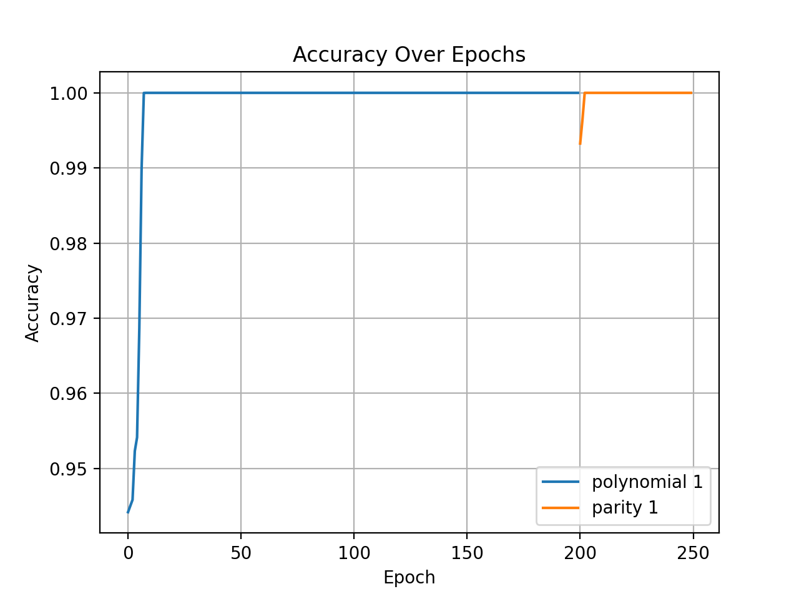
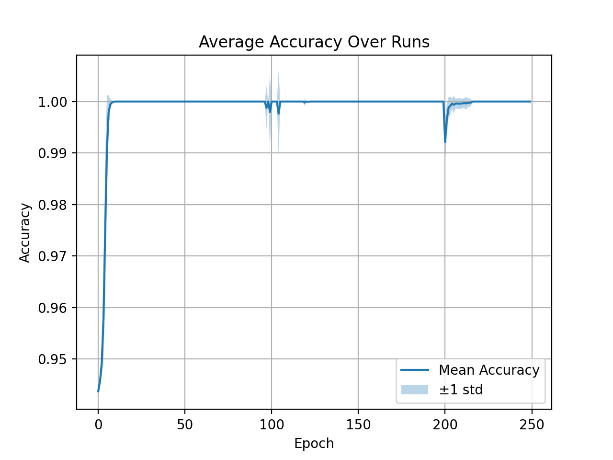
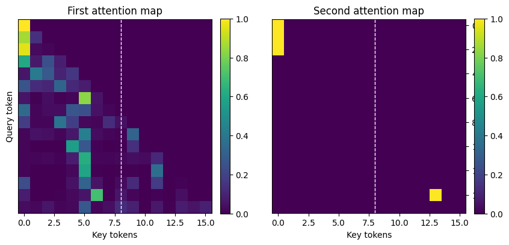
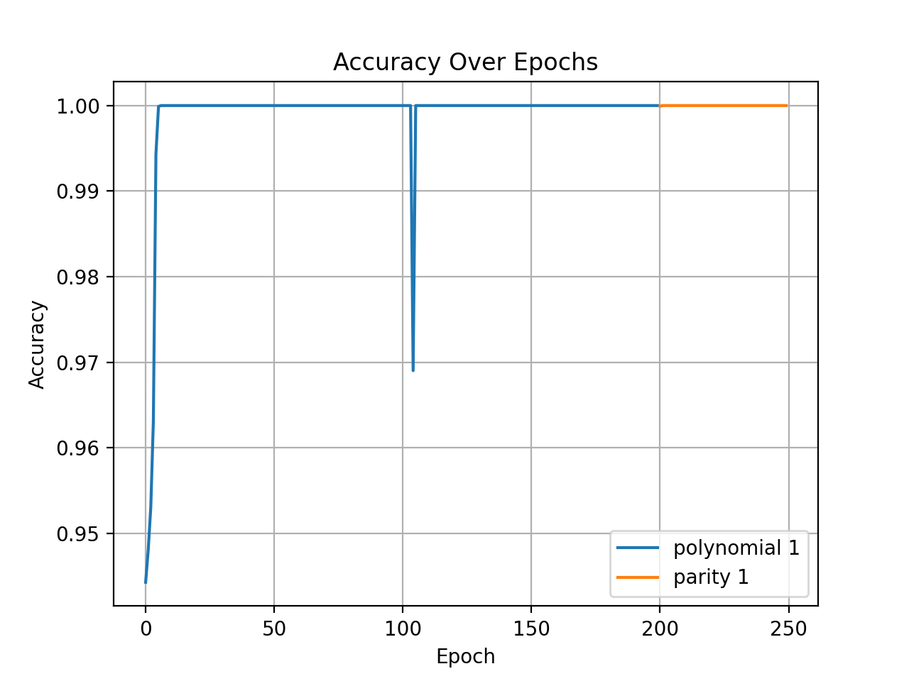
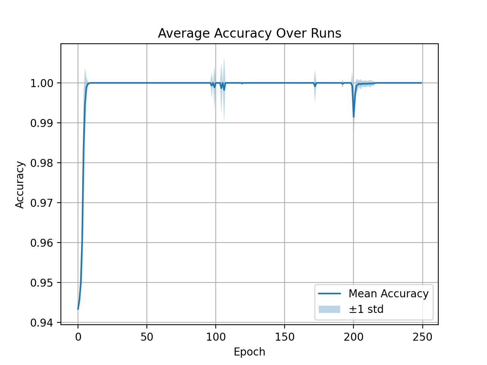
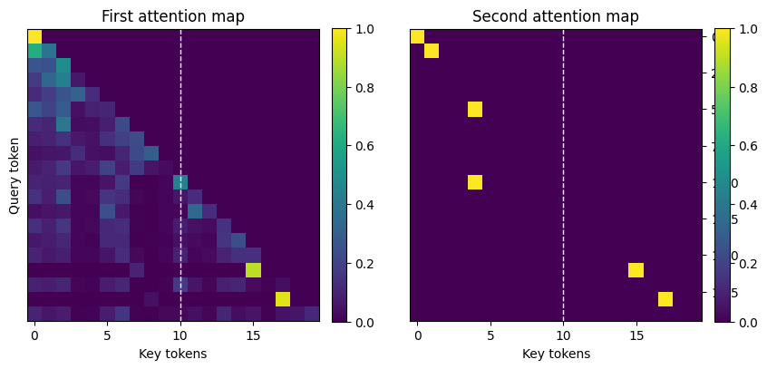
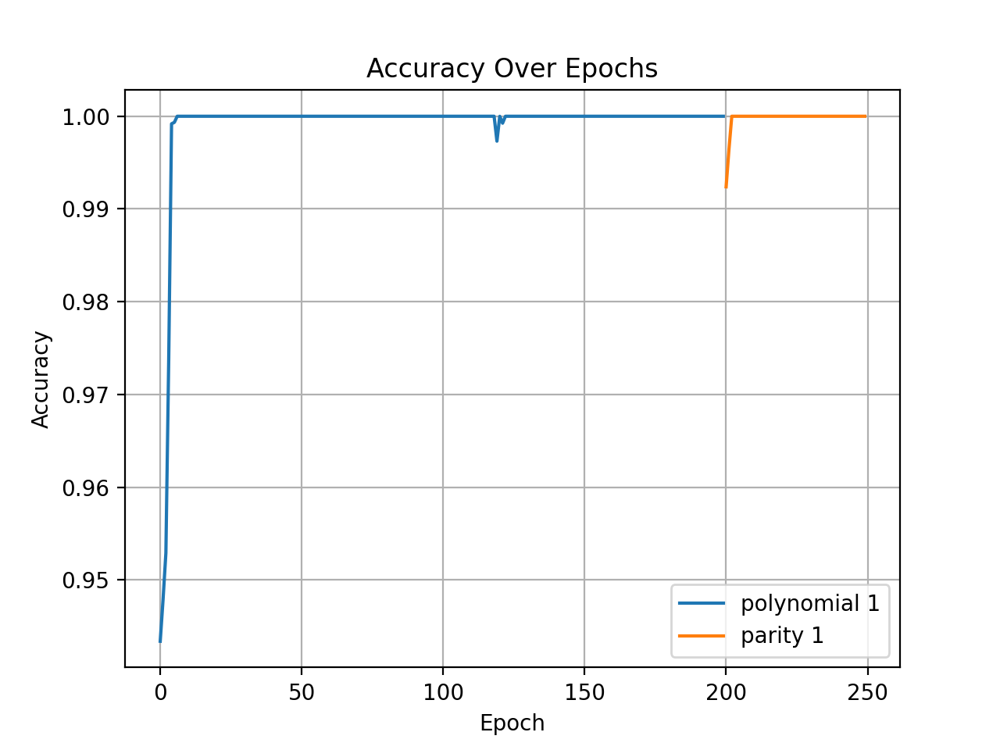
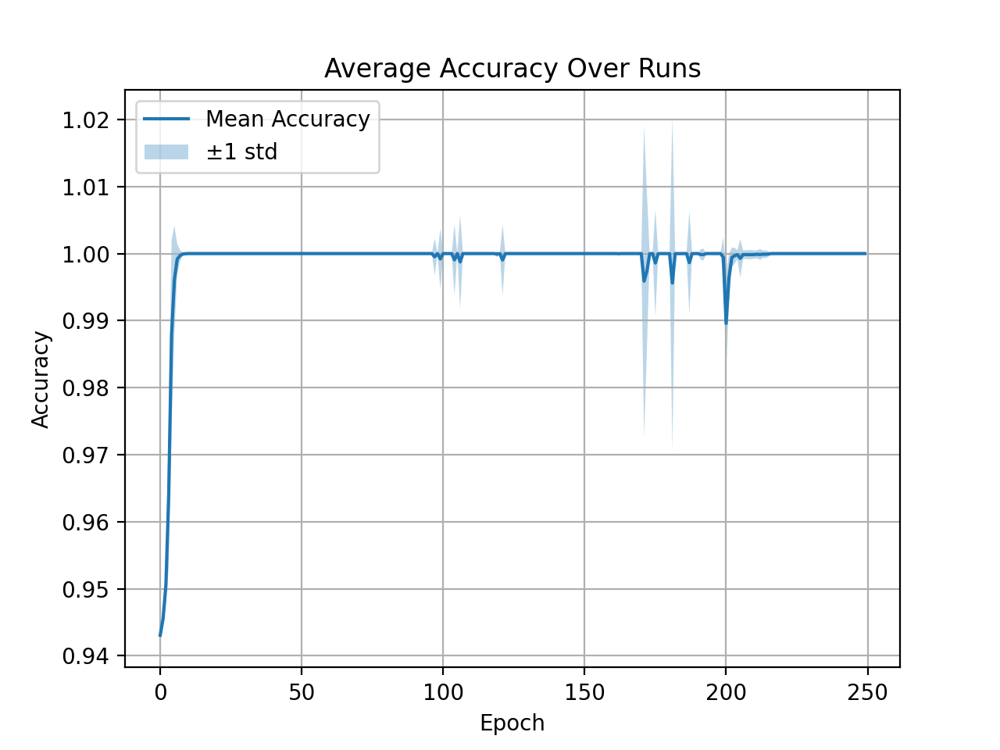
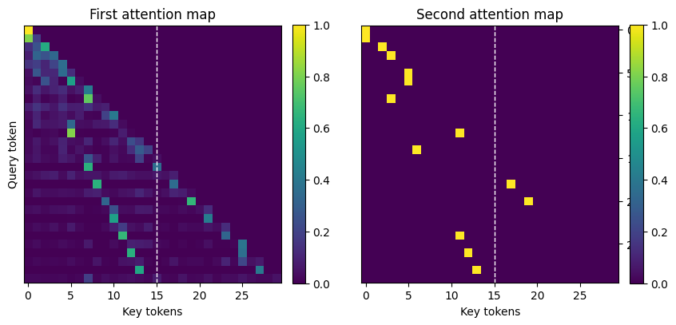

## Iteration Heads and Chain-of-Thought in Small Transformers  

**Aviv Abou (ID: 207597980); Noa Ben David (ID: 300950565)**  

**Submitted as final project report for the NLP course, IDC, 2025**

---

## 1. Introduction  

Chain-of-Thought (CoT) reasoning has been shown to improve the capabilities of large language models by allowing them to generate intermediate reasoning steps rather than predicting answers directly. Recent mechanistic interpretability work by Cabannes et al. (2024) introduced the concept of **iteration heads** — specialized attention circuits within transformers that enable them to perform iterative reasoning efficiently.  

In this project, we aimed to (1) replicate the core findings of the original study, which showed that even small 2-layer transformers can learn iterative tasks through iteration heads, and (2) extend the scope by testing whether deeper transformers (4- and 6-layers) and new algorithmic tasks (factorial and Fibonacci) still exhibit similar CoT phenomena.  

Our motivation is twofold: first, to validate the reproducibility of mechanistic interpretability findings, and second, to explore how transformer depth and task complexity influence the emergence of iteration heads.  

---

## 1.1 Related Work  

Our project builds directly on Cabannes et al. (2024) *Iteration Head: A Mechanistic Study of Chain-of-Thought* but adds depth variation and explores skill transferability on more complex iterative algorithms.  

---

## 2. Methodology  

### 2.1 Baseline Replication  

We started by replicating the **2-layer, 1-head transformer** experiments from the original paper, training models on two synthetic tasks:  
- **Parity**: compute sum of bits mod 2.  
- **Polynomial Iteration**: evaluate `P(s,x) = x*y+1 mod 11`.  

We used the official implementation from git repository [facebookresearch/pal](https://github.com/facebookresearch/pal/tree/main) to ensure correctness. Hyperparameters matched the paper: embedding dim = 128, 1 head, Adam optimizer, lr = 3e-4, batch size 256.
Datasets were synthetic with uniform random generation. 
The Polynomial trained for the first 200 epochs and then switch the dataset to learn the parity problem.

### 2.2 Extensions  

We explored two extensions:  

1. **Deeper Transformers**:  
   - We extended experiments to **4- and 6-layer models** by modifying the `n_layers` parameter in `TransformerConfig`.  
   - Goal: test whether additional layers improve convergence, stability, or circuit formation.  

2. **New Iterative Algorithms**:  
   - **Factorial**: compute running product `1·2·…·N`.  
   - **Fibonacci**: generate sequence `F1…Fn`.  
   - These tasks were encoded as iterative state updates and trained with the same architecture.  

### 2.3 Evaluation
- **Accuracy over epochs** (single-run and averaged across seeds)
- **Attention heatmaps** to identify iteration-head-like patterns
- **Variance across runs** (mean ± std plots)
- Comparison across depths (2, 4, 6 layers)

---

## 3. Experimental Results

### 3.1 Replication (2-layer baseline)

We successfully replicated the original findings.

*Figure 1: Accuracy of 2-layer transformer on polynomial (blue) and parity (orange).*
  

*Figure 2: Mean ± std accuracy across multiple runs for 2-layer transformer. Staircase convergence matches the original paper.*
  

*Figure 3: Attention heads for 2-layer transformer on parity. Iteration-head-like diagonal-to-next-token behavior is visible.*
  

---

### 3.2 Depth Study: 4-layer transformers
The 4-layer models reached higher accuracy (~0.96–0.97) and exhibited smoother convergence across runs.

*Figure 4: Accuracy of 4-layer transformer on polynomial and parity tasks.*
  

*Figure 5: Multi-run average for 4-layer model. Variance reduced compared to 2-layer.*
  

*Figure 6: Attention heads for 4-layer transformer. Iteration-head-like patterns still concentrated in early layers.*
  

---

### 3.3 Depth Study: 6-layer transformers
The 6-layer transformers achieved near-perfect accuracy (~0.99–1.0) and even more stable curves, but with diminishing returns compared to 4 layers.

*Figure 7: Accuracy of 6-layer transformer on polynomial and parity tasks.*
  

*Figure 8: Multi-run average for 6-layer transformer. Very low variance, stable convergence.*
  

*Figure 9: Attention heads for 6-layer transformer. Iteration heads still appear early, deeper layers add redundancy.*
  

---

### 3.4 Cross-depth comparison
| Depth | Polynomial Accuracy | Parity Accuracy | Variance | Notes |
|-------|---------------------|-----------------|----------|-------|
| 2-layer | ~0.92 | ~0.72–0.75 | High | Matches replication, unstable later epochs |
| 4-layer | ~0.96 | ~0.85 | Low | Smoother convergence, better transfer |
| 6-layer | ~0.99–1.0 | ~0.90 | Very low | Diminishing returns; later layers redundant |

---

### 3.5 Factorial and Fibonacci  

---

## 4. Discussion  

Our experiments confirm that iteration heads emerge reliably in **2-layer transformers**, reproducing the original study.

When scaling to **4 and 6 layers**, accuracy improved slightly and training stability increased, but the fundamental mechanism did not change: attention maps show that iteration heads still form in early layers, while later layers often remain underutilized or redundant.

This supports the interpretation that **iteration heads are minimal circuits**: once the architecture is sufficiently deep to host them (2 layers), adding more depth provides little new capability. Instead, extra layers primarily act as stabilizers and reduce variance across runs.

---

## 5. Code  

All code, including replication and extended experiments, is available at:  
- Original repo: [facebookresearch/pal](https://github.com/facebookresearch/pal/tree/main)  
- Our repository: [NLP Project](https://github.com/avivabou/pal/NLP_Project.git)
- Replication notebook: `replication.ipynb`  
- 

---

## References  

- Cabannes, V., Arnal, C., Bouaziz, W., Yang, A., Charton, F., & Kempe, J. (2024). *Iteration Head: A Mechanistic Study of Chain-of-Thought*. NeurIPS 2024:contentReference[oaicite:6]{index=6}.  
